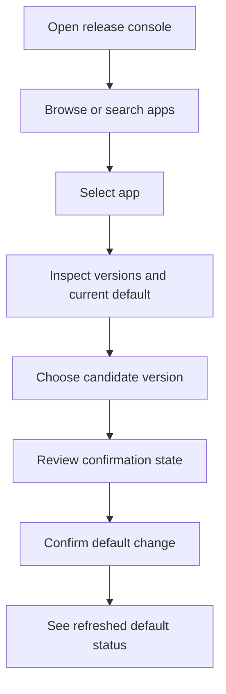

# MicroApps Release Console Rebuild

## Problem Frame
The current release console solves a real internal need, but it feels dated, visually weak, and heavier than the job requires. Today the app is mostly an operator UI for browsing MicroApps applications, inspecting versions and rules, and changing the default release version. The current experience makes this core workflow feel more awkward and brittle than it should, while carrying enough frontend weight that performance and startup speed are now active product concerns.

The rebuild should preserve the console's core job while making it feel intentionally designed, faster to load, and safer to use. This is not a mandate to expand scope into a full release-management product. The goal is to make the existing tool feel sharp, trustworthy, and pleasant without recreating the dependency and bundle problems of the current app.

## Requirements

**Experience and Visual Direction**
- R1. The rebuilt console must adopt a terminal-inspired visual language that feels intentional and high-personality rather than generic admin UI.
- R2. The interface must feel materially more polished than the current app while still reading as a practical operations tool, not a marketing surface.
- R3. The console must preserve a compact, keyboard-friendly, browse-first layout that works well on common laptop widths so operators can scan data quickly without excessive clicks or oversized card-based chrome.

**Browsing and Inspection**
- R4. The main screen must make it easy to browse all applications, select one, and inspect its available versions and active rules from a single primary workflow.
- R5. The console must improve browsing quality with search, filtering, or similarly lightweight discovery affordances so operators can find apps and versions faster than they can today.
- R6. The selected app view must make the current default version obvious and visually distinct from other versions.
- R7. The selected app view must present the most relevant operational metadata clearly enough for quick inspection, including version status and routing or startup context when available.

**Safer Default Changes**
- R8. Changing the default version must remain available from the main workflow rather than being moved into a separate admin area.
- R9. A default-version change must require an explicit confirmation step that shows the operator what app is being changed and the before-and-after default version state, and no change may be persisted before that confirmation.
- R10. After a successful change, the interface must refresh promptly and clearly show the newly active default version.

**Speed and Carrying Cost**
- R11. The rebuild must prioritize fast startup and small client payloads as first-order product constraints rather than treating them as secondary optimizations.
- R12. The new console must keep its dependency footprint intentionally small and avoid reintroducing large, broad UI frameworks whose weight is disproportionate to this tool's scope.

## Success Criteria
- Operators can find an app, inspect its versions, identify the current default, and change that default with confidence from a single session in the main UI.
- The rebuilt console feels substantially more modern, deliberate, and pleasant than the current app without losing the operational clarity of a release tool.
- Startup and navigation feel fast enough that the app no longer reads as a heavy internal dashboard.
- The rebuild avoids a repeat of the current oversized frontend bundle problem by treating size and dependency discipline as explicit acceptance criteria.

## Scope Boundaries
- V2 does not expand into a full release-management suite with create, delete, deploy, or broad lifecycle management workflows.
- V2 does not add a general audit-history or change-history product surface.
- V2 does not attempt to become a general MicroApps administration console for every possible record type or metadata field.
- V2 does not prioritize a framework migration away from Next.js; it focuses on a lean rebuild within the current platform support model.

## Key Decisions
- Keep the product scope close to the current app's core behavior rather than expanding feature surface.
- Use a terminal-inspired visual direction to make the console distinctive and more enjoyable to use.
- Keep default-version mutation in the main screen, but add an explicit confirmation step for safety.
- Optimize first for better browsing and clearer state visibility rather than adding new mutation workflows.
- Keep the rebuild on Next.js, while treating framework and dependency choices as part of the performance problem to solve.
- Favor Tailwind CSS with selective `shadcn/ui` usage as a speed-to-polish path, while keeping dependency creep under control.

## Dependencies / Assumptions
- The rebuild continues to use the existing MicroApps applications, versions, and rules data model.
- The underlying dataset is currently small enough that browsing can remain simple and immediate without pagination as a V2 requirement.
- The deployment environment continues to support Next.js applications cleanly on the existing MicroApps runtime.

## Outstanding Questions

### Resolve Before Planning
- None.

### Deferred to Planning
- [Affects R4, R11, R12][Technical] Decide the leanest Next.js architecture for this console while preserving compatibility with the current MicroApps deployment model.
- [Affects R8, R9, R10][Technical] Decide the mutation boundary for default-version changes so the client bundle stays small while the confirmation flow remains responsive.
- [Affects R11, R12][Needs research] Define the bundle-size and startup-performance budget that planning and implementation must enforce.

## Next Steps
→ /prompts:ce-plan for structured implementation planning
