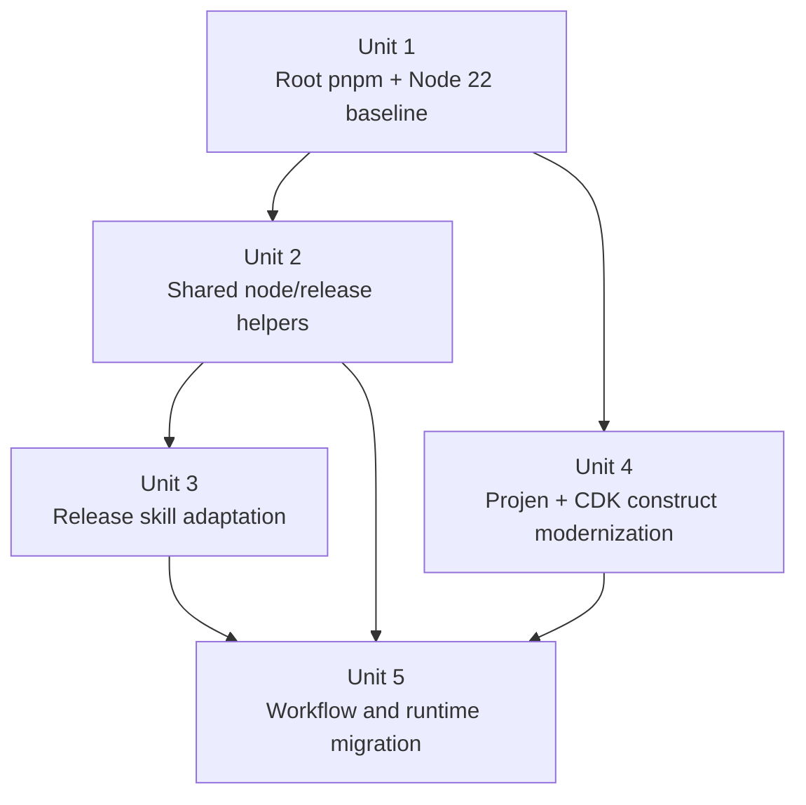

# Refactor app-release tooling to pnpm, Node 22, and core-aligned release automation

## Overview

Modernize the repository so its package management, release tooling, and CDK construct automation align with the current `microapps-core` baseline. The change set brings in the shared `configure-nodejs` composite action, ports and adapts the release skill, standardizes the repo on `pnpm`, raises the Node baseline to 22, and introduces a durable `projen` source of truth for `packages/cdk-construct` so future version drift is controlled in one place.

## Problem Frame

This repo is still organized around an older `npm` workspace and pre-projen jsii release flow:

- the root and package-level lockfiles are `package-lock.json`
- root scripts shell through `npm` workspaces
- GitHub Actions jobs hardcode `actions/setup-node` plus `npm ci`
- `packages/cdk-construct` is not `projen`-managed, even though the comparable package in `microapps-core` now is
- Node versions are split across `.nvmrc`, workflow `node-version` settings, a `nodejs20.x` Lambda runtime, and package metadata

The requested work is not a simple dependency bump. It touches four coupled contract surfaces at once:

- repo package-management behavior
- GitHub Actions bootstrap and cache behavior
- jsii/CDK packaging for `packages/cdk-construct`
- human/operator release workflow via the imported release skill

The biggest technical wrinkle is that this repo also has older Next.js standalone packaging workarounds and jsii build workarounds that may not survive a straight copy of `microapps-core`'s current setup. The plan therefore aims for alignment with `microapps-core` while preserving this repo's app-packaging behavior.

## Requirements Trace

- R1. The repo uses `pnpm` as its primary package manager, with a single root source of truth for workspace installation.
- R2. `pnpm` should remain isolated by default if the build permits it; if the current app/jsii flow cannot tolerate that, the fallback must be an explicit, minimal compatibility setting rather than accidental hoisting.
- R3. The shared `configure-nodejs` action from `microapps-core` is added, along with the helper scripts it depends on, and the repo's workflows are updated to consume it.
- R4. The release skill from `microapps-core` is added with repo-specific adaptations so it accurately describes this repo's release workflow, package surface, and temporary artifact paths.
- R5. Minimum versions align to the `microapps-core` floor where relevant: `aws-cdk-lib` / peer dependencies at `2.168.0`, root `aws-cdk` CLI support at `^2.1000.0`, `projen` at `0.98.10`, and Node minimums at `22.0.0`.
- R6. Node 22 becomes the baseline everywhere that matters: local development, CI, package metadata, and the deployed Lambda runtime used by `packages/cdk-construct`.
- R7. Existing release packaging behavior remains intact: the Next.js app still builds, its standalone output still gets folded into the construct artifact, and jsii publishing still emits the same published package names and release channels.

## Scope Boundaries

- Major framework upgrades for the app stack, such as migrating Next.js or React to newer major versions, are out of scope unless a narrow compatibility bump is required to make Node 22 viable.
- App feature changes, UI redesign, and DynamoDB behavior changes are out of scope.
- Replacing the repo's release policy is out of scope. The imported release skill should adapt to the existing release model rather than invent a new one.
- Changing published package names, language targets, or Construct Hub identity is out of scope.

## Context & Research

### Relevant Code and Patterns

- `package.json` defines the root workspace and all repo-level scripts, and currently shells through `npm` for workspace-scoped commands.
- `.nvmrc` currently pins `v16.17.1`, while workflows mostly use Node 20 and `packages/cdk-construct/src/index.ts` hardcodes `nodejs20.x` for the deployed Lambda runtime.
- `.github/workflows/ci.yml`, `.github/workflows/r_build-app.yml`, `.github/workflows/r_version.yml`, `.github/workflows/jsii.yml`, `.github/workflows/pr-closed.yml`, and `.github/workflows/release.yml` all assume `npm ci`, root `package-lock.json`, and direct `actions/setup-node` usage.
- `.github/workflows/r_build-app.yml` and `.github/workflows/release.yml` both hide the root `package.json` / `package-lock.json` so package-local installs can occur inside `packages/app` or `packages/cdk-construct`; that is a strong signal that package-local island behavior may still matter after the migration.
- `CONTRIBUTING.md` documents an existing jsii build issue around `packages/cdk-construct/tsconfig.json` and `skipLibCheck`, which means the future `projen` source needs to preserve or replace that workaround deliberately.
- `packages/cdk-construct/package.json` still carries `aws-cdk-lib` `2.24.0`, jsii `1.x`, and `engines.node >= 12.0.0`, while the corresponding package in `microapps-core` now uses `aws-cdk-lib` `2.168.0`, jsii `^5.4`, `projen` `0.98.10`, and `engines.node >= 22.0.0`.
- `packages/app/next.config.js` already uses `output: 'standalone'` and output tracing, so package-manager changes have a direct effect on release packaging.

### Institutional Learnings

- There is no local `docs/brainstorms/` or `docs/solutions/` history in this repo, so the best prior art is live code plus the upstream `microapps-core` implementation.
- `microapps-core` already solved three of the requested concerns in durable form:
  - shared Node bootstrap at `.github/actions/configure-nodejs/action.yml`
  - tag parsing and release metadata helpers at `scripts/release-tag.mjs` and `scripts/release-metadata.mjs`
  - `projen` ownership of the jsii construct package at `packages/microapps-cdk/.projenrc.js`
- `microapps-core/packages/microapps-cdk/AGENTS.md` records an important packaging lesson: `projen` and jsii may still require a standalone package install path (`pnpm install --frozen-lockfile --ignore-workspace`) even after the repo itself becomes pnpm-first.

### External References

- External research was not required for this pass because the repo has direct upstream prior art in `microapps-core` for each requested change, and the plan is intentionally aligning to that local source of truth rather than choosing fresh versions from the ecosystem.

## Key Technical Decisions

- Import the shared action and release helpers from `microapps-core` as adapted copies, not blind syncs.
  Rationale: the upstream files are the right starting point, but this repo still uses reusable workflows like `r_build-app.yml` and only publishes one jsii package family. Adapting at import time avoids carrying `microapps-core`-specific assumptions into this repo.

- Standardize the repo root on `pnpm`, but treat strict isolation as the preferred first state rather than a guaranteed end state.
  Rationale: the user explicitly wants isolation if possible, and pnpm's default behavior is the cleanest way to expose undeclared dependency assumptions. However, the current app packaging and jsii island behavior already show signs that some compatibility relaxation may be needed. The migration should start from isolation and only add `.npmrc` compatibility settings if observed failures justify it.

- Introduce `projen` for `packages/cdk-construct` before trying to keep versions aligned manually.
  Rationale: once this package needs to match `microapps-core` on CDK, Projen, Node, and release automation, hand-maintained generated files become the main source of future drift. A `.projenrc.js` source of truth is the durable fix.

- Preserve repo-specific release packaging behavior even if the construct package becomes `projen`-managed.
  Rationale: unlike `microapps-core/packages/microapps-cdk`, this package bundles a built Next.js app into its published artifact. The new `projen` configuration must model that packaging flow explicitly instead of assuming the upstream construct config can be copied as-is.

- Align Node 22 at both the exact-tool and minimum-engine levels.
  Rationale: matching `microapps-core` means using its local shell baseline (`.nvmrc` `v22.14.0`) while also updating package `engines` and workflow defaults to `22.x`. That reduces accidental drift between local development, CI, and deployed Lambda behavior.

## Open Questions

### Resolved During Planning

- Should the imported release skill stay `microapps-core`-specific?
  No. It should be copied and then rewritten for this repo's single-construct release surface, workflow name, and package names.

- Should the repo force `pnpm` isolation even if the existing packaging flow breaks?
  No. Isolation is the preferred starting point, but the implementation should fall back to the smallest explicit compatibility setting that restores the current app/jsii packaging behavior.

- Should version alignment be done by editing `packages/cdk-construct/package.json` directly?
  No. Direct edits would leave this repo without an owned source of truth and would quickly drift from the new baseline again.

### Deferred to Implementation

- Whether `packages/app` can build its standalone output entirely from the root pnpm workspace install, or whether it still needs a package-local install island during release packaging.
  This depends on observed Next.js output tracing behavior under pnpm and should be decided from real build results.

- Whether `packages/cdk-construct` needs a package-local `pnpm-lock.yaml` plus `--ignore-workspace`, similar to `microapps-core/packages/microapps-cdk`.
  This depends on how `projen`, jsii, and the release workflow behave after the source-of-truth migration.

- Whether the current Next 12 / Storybook 6 era toolchain is compatible enough with Node 22 to avoid any supporting dependency bumps.
  This is a runtime/build validation question and should be answered by the first Node 22 build pass.

- Whether the pinned `jsii/superchain` container digest remains suitable once Node 22, jsii `^5.4`, and `projen` `0.98.10` are in play.
  The correct answer depends on the first CI execution after the upgrade.

## High-Level Technical Design

> *This illustrates the intended approach and is directional guidance for review, not implementation specification. The implementing agent should treat it as context, not code to reproduce.*

| Surface | Source of truth after the refactor | Preferred install/runtime mode | Fallback if the preferred mode breaks |
|---|---|---|---|
| Repo root | `package.json` + `pnpm-workspace.yaml` + root `pnpm-lock.yaml` | pnpm workspace install with isolated dependency layout | minimal `.npmrc` compatibility settings, including hoist or linker changes only if needed |
| Shared CI bootstrap | `.github/actions/configure-nodejs/action.yml` + `scripts/package-manager/resolve-manager.mjs` | multi-manager aware bootstrap, defaulting to repo-pinned pnpm | explicit manager override in callers |
| Release operator workflow | `.agents/skills/release/SKILL.md` + release tag/metadata scripts | repo-specific release notes and workflow watching | adapt the skill text if the workflow name or publish shape differs |
| jsii construct package | `packages/cdk-construct/.projenrc.js` | projen-managed pnpm package using the core version floor | standalone package island with its own lockfile if workspace coupling remains too fragile |
| App packaging into the construct | `r_build-app.yml`, `release.yml`, and `packages/app/next.config.js` | root pnpm install feeding Next standalone output into `packages/cdk-construct/lib` | package-local install step kept intentionally for app or construct build stages |

## Implementation Units

- [ ] **Unit 1: Establish the root pnpm and Node 22 baseline**

**Goal:** Move the repo root to pnpm, raise the shared Node baseline, and eliminate npm lockfile drift before deeper workflow and projen work begins.

**Requirements:** R1, R2, R5, R6

**Dependencies:** None

**Files:**
- Create: `pnpm-workspace.yaml`
- Create: `pnpm-lock.yaml`
- Create: `.npmrc` (only if compatibility settings prove necessary)
- Create: `tests/package-manager/root-workspace-smoke.test.mjs`
- Modify: `package.json`
- Modify: `.nvmrc`
- Modify: `.gitignore`
- Modify: `CONTRIBUTING.md`
- Modify: `packages/app/package.json`
- Modify: `packages/cdk-stack/package.json`
- Delete: `package-lock.json`
- Delete: `packages/app/package-lock.json`
- Delete: `packages/cdk-construct/package-lock.json`

**Approach:**
- Pin the root package manager to `pnpm@10.29.3`, matching `microapps-core`, and move workspace package globs into `pnpm-workspace.yaml`.
- Rewrite root scripts so workspace-scoped commands use pnpm semantics instead of `npm -w` and `npm exec --workspaces`.
- Raise `.nvmrc` to the upstream exact version (`v22.14.0`) and add `engines.node >= 22.0.0` to the root and non-projen package manifests that are not generated elsewhere.
- Add `.local/` ignore coverage so the future release skill can store planner artifacts without dirtying the worktree.
- Start with pnpm's default isolated layout; only add `.npmrc` compatibility settings if the first build reveals a concrete package-resolution failure.

**Patterns to follow:**
- Upstream root metadata in `microapps-core/package.json`
- Upstream shell baseline in `microapps-core/.nvmrc`
- Upstream workspace declaration in `microapps-core/pnpm-workspace.yaml`

**Test scenarios:**
- Happy path: a fresh root install produces `pnpm-lock.yaml` and completes without consulting any `package-lock.json`.
- Happy path: root scripts for build, lint, clean, and app-local development still resolve workspace packages after the pnpm rewrite.
- Edge case: pnpm's isolated layout exposes a missing dependency or hoist assumption, and the failure clearly identifies the affected package instead of silently succeeding with legacy lockfile state.
- Integration: developer commands documented in `CONTRIBUTING.md` still work from the repo root after the package-manager switch.

**Verification:**
- The repo has one root lockfile, root scripts are pnpm-first, `.nvmrc` and package engines align on Node 22, and no remaining tracked workflow path depends on `package-lock.json`.

- [ ] **Unit 2: Import the shared Node bootstrap and release helper scripts**

**Goal:** Bring in the reusable building blocks from `microapps-core` that the workflow migration and release skill both depend on.

**Requirements:** R3, R4, R6

**Dependencies:** Unit 1

**Files:**
- Create: `.github/actions/configure-nodejs/action.yml`
- Create: `scripts/package-manager/resolve-manager.mjs`
- Create: `scripts/package-manager/resolve-manager.test.mjs`
- Create: `scripts/release-tag.mjs`
- Create: `scripts/release-metadata.mjs`
- Create: `scripts/release-tag.test.mjs`
- Create: `tests/workflows/configure-nodejs-contract.test.mjs`
- Modify: `package.json`

**Approach:**
- Copy the upstream helper scripts with minimal semantic changes so manager resolution and release tag parsing stay compatible with the current `microapps-core` behavior.
- Keep the composite action multi-manager aware even though this repo becomes pnpm-first, because the imported action is intended to stay reusable and explicit.
- Use small Node-built-in smoke tests for the imported scripts because the repo currently lacks a root test harness for standalone workflow helpers.
- Add a lightweight repo-tools test script at the root so the new smoke tests have a stable local and CI execution path.
- Keep workflow-specific decisions out of these helpers so later units can wire them into this repo's existing reusable workflow structure.

**Execution note:** Add the helper-script smoke tests before changing workflow callers so the imported contract is pinned down before YAML rewiring begins.

**Patterns to follow:**
- Upstream action in `microapps-core/.github/actions/configure-nodejs/action.yml`
- Upstream manager resolution helper in `microapps-core/scripts/package-manager/resolve-manager.mjs`
- Upstream release helpers in `microapps-core/scripts/release-tag.mjs` and `microapps-core/scripts/release-metadata.mjs`

**Test scenarios:**
- Happy path: explicit `package-manager=pnpm` selects `pnpm-lock.yaml`, enables Corepack, and emits a pnpm frozen-lockfile install command.
- Happy path: explicit `package-manager=npm` selects `package-lock.json` or `npm-shrinkwrap.json` and emits `npm ci`.
- Edge case: `package.json` pins `pnpm@...` and no explicit input is passed, so the helper resolves pnpm even if stale alternate lockfiles are present elsewhere in the tree.
- Error path: multiple supported root lockfiles without an explicit override produce a clear failure instead of silently choosing the wrong manager.
- Happy path: `v1.2.3` parses as a stable release and `v1.2.3-beta.4` parses as a prerelease whose npm dist-tag is `beta`.
- Error path: malformed release tags fail with a human-readable error rather than producing ambiguous metadata.

**Verification:**
- The repo contains a tested, repo-local copy of the shared bootstrap and release helper contracts, and workflows can consume those helpers without re-embedding manager or tag logic.

- [ ] **Unit 3: Bring in and adapt the release skill**

**Goal:** Add the `microapps-core` release skill to this repo in a form that accurately describes this repo's publish flow and can be used without manual mental translation.

**Requirements:** R4, R7

**Dependencies:** Unit 2

**Files:**
- Create: `.agents/skills/release/SKILL.md`
- Create: `.agents/skills/release/scripts/release_plan.py`
- Modify: `.github/workflows/release.yml`
- Modify: `.gitignore`

**Approach:**
- Port the upstream release skill and planner script, then rewrite the repo notes and approval guidance for `microapps-app-release` realities:
  - one construct-centered publish surface instead of the broader `microapps-core` multi-package set
  - this repo's release workflow name and artifact names
  - `.local/release/` as the scratch area
- Align the release workflow naming and metadata with the skill wherever that can be done cheaply, so the operator instructions and automation are not permanently out of sync.
- Reuse the imported release tag and metadata helpers from Unit 2 instead of maintaining a second interpretation of release tags in YAML.

**Patterns to follow:**
- Upstream skill in `microapps-core/.agents/skills/release/SKILL.md`
- Upstream planner in `microapps-core/.agents/skills/release/scripts/release_plan.py`

**Test scenarios:**
- Test expectation: none -- this unit is primarily skill text and workflow-metadata alignment. Validation should be done by invoking the planner in a clean tree and confirming the skill's referenced workflow, tag format, and scratch paths all exist and match reality.

**Verification:**
- A maintainer can use the local release skill without encountering `microapps-core`-specific package names, missing helper files, or incorrect workflow references.

- [ ] **Unit 4: Introduce projen ownership and align the construct package version floor**

**Goal:** Make `packages/cdk-construct` follow the same version floor and ownership model as `microapps-core/packages/microapps-cdk`, while preserving this repo's bundled-app packaging behavior.

**Requirements:** R2, R5, R6, R7

**Dependencies:** Unit 1

**Files:**
- Create: `packages/cdk-construct/.projenrc.js`
- Create: `packages/cdk-construct/test/PackageManager.spec.ts`
- Create: `packages/cdk-construct/.npmrc` (if the generated project needs standalone pnpm settings)
- Create: `packages/cdk-construct/pnpm-lock.yaml` (only if the construct remains a standalone install island)
- Modify: `package.json`
- Modify: `packages/cdk-construct/package.json`
- Modify: `packages/cdk-construct/tsconfig.json`
- Modify: `packages/cdk-construct/.gitignore`
- Modify: `packages/cdk-construct/README.md`
- Modify: `packages/cdk-construct/API.md`
- Create or Modify: `packages/cdk-construct/.github/workflows/build.yml`
- Create or Modify: `packages/cdk-construct/.github/workflows/release.yml`
- Create or Modify: `packages/cdk-construct/.projen/*`

**Approach:**
- Build a new `.projenrc.js` from the upstream `microapps-core` construct config, then adapt it for this package name, publishing metadata, and compile/package hooks.
- Pin the important floor values at the source-of-truth layer: `cdkVersion: '2.168.0'`, `minNodeVersion: '22.0.0'`, `packageManager: javascript.NodePackageManager.PNPM`, `pnpmVersion: '10'`, and `projen: 0.98.10`.
- Preserve the repo-specific app bundling flow by explicitly modeling the custom build steps that copy the built Next.js app and static assets into the construct output. Do not assume the upstream construct's compile hooks are sufficient.
- Replace or encode the current `skipLibCheck` workaround in the projen source rather than leaving it as a hand-edited workflow-only mutation.
- Add a guard test similar to `microapps-core/packages/microapps-cdk/test/PackageManager.spec.ts` so future edits cannot quietly revert the package manager, Node floor, or generated workflow assumptions.

**Technical design:** *(directional guidance, not implementation specification)*

`packages/cdk-construct/.projenrc.js` should own the generated package metadata and package-local workflows, while custom hooks continue to express the repo-specific steps that turn the built app artifact into publishable construct assets. The implementation should prefer source-of-truth hooks over post-generation patching.

**Patterns to follow:**
- Upstream `projen` source in `microapps-core/packages/microapps-cdk/.projenrc.js`
- Upstream guard test in `microapps-core/packages/microapps-cdk/test/PackageManager.spec.ts`
- Existing construct packaging expectations in `packages/cdk-construct/src/index.ts`

**Test scenarios:**
- Happy path: regenerating `packages/cdk-construct` from `.projenrc.js` preserves the intended package name, publishing targets, and Node 22 / pnpm / CDK 2.168.0 version floor.
- Happy path: the guard test confirms pnpm and Node 22 are pinned in the source of truth and in the generated outputs.
- Edge case: the generated package still requires a standalone install path; if so, the package-local lockfile and workflow steps remain internally consistent instead of fighting the root workspace.
- Error path: if jsii or the app-bundling hooks cannot be expressed cleanly in `projen`, the failure appears at the source-of-truth layer rather than as drift in generated files.
- Integration: `packages/cdk-construct/src/index.ts` still points at build output locations that match the generated packaging flow, including the bundled server assets and Lambda runtime assumptions.

**Verification:**
- `packages/cdk-construct` has a durable source of truth that matches the requested version floor and package-manager posture, and a future `projen` run does not reintroduce old npm-era behavior.

- [ ] **Unit 5: Migrate workflows and runtime wiring to the new baseline**

**Goal:** Update the repo's CI, release, cleanup, and runtime wiring to use the imported helpers, Node 22, and the new pnpm/projen assumptions without breaking the current publish pipeline.

**Requirements:** R1, R3, R5, R6, R7

**Dependencies:** Units 2, 3, and 4

**Files:**
- Create: `tests/workflows/node22-release-smoke.test.mjs`
- Modify: `.github/workflows/ci.yml`
- Modify: `.github/workflows/r_build-app.yml`
- Modify: `.github/workflows/r_version.yml`
- Modify: `.github/workflows/jsii.yml`
- Modify: `.github/workflows/pr-closed.yml`
- Modify: `.github/workflows/release.yml`
- Modify: `package.json`
- Modify: `packages/app/package.json`
- Modify: `packages/app/next.config.js` (only if output tracing needs an explicit workspace root or packaging adjustment)
- Modify: `packages/cdk-construct/src/index.ts`
- Modify: `README.md`
- Modify: `packages/cdk-stack/README.md`
- Modify: `packages/cdk-stack/package.json`

**Approach:**
- Replace direct `actions/setup-node` usage with the shared `configure-nodejs` action everywhere the repo installs dependencies, and update remaining workflow steps to assume pnpm-rooted commands.
- Raise workflow Node versions to `22.x`, including any package-local or release-only jobs that currently sit on 16 or 20.
- Update package-version application steps so they remain correct under pnpm and across workspaces without depending on npm-specific workspace behavior.
- Rework the release-path package-local install steps deliberately:
  - prefer root-workspace installs where Next.js output tracing and jsii packaging tolerate them
  - keep an intentional package-local island when that is the only stable option
- Raise the Lambda runtime in `packages/cdk-construct/src/index.ts` from `nodejs20.x` to the Node 22 runtime family so deployed behavior matches the new baseline.
- Audit stale CDK-era dependencies such as `@aws-cdk/assert` and remove or replace them if the version bump makes them invalid.

**Patterns to follow:**
- Existing reusable workflow split in `.github/workflows/r_version.yml` and `.github/workflows/r_build-app.yml`
- Upstream Node bootstrap usage in `microapps-core/.github/workflows/release.yml`
- Existing construct runtime wiring in `packages/cdk-construct/src/index.ts`

**Test scenarios:**
- Happy path: CI jobs install through the shared action and complete their build or lint stages on Node 22.
- Happy path: the release workflow still builds the Next.js app, stages it into `packages/cdk-construct/lib`, runs the construct packaging flow, and uploads the expected release artifact.
- Edge case: Next.js output tracing under pnpm isolated layout misses runtime modules; the workflow either compensates through explicit configuration or intentionally falls back to a package-local install path.
- Edge case: jsii / `projen release` still requires a standalone package install path, and the workflow uses the correct lockfile and package manager for that island rather than falling back to npm by accident.
- Error path: if Node 22 exposes an unsupported dependency in the old Next.js or Storybook stack, the failure occurs in a targeted build job with clear ownership rather than surfacing later as a broken published artifact.
- Integration: the deployed Lambda runtime, generated release metadata, and imported release skill all agree on the release baseline and workflow naming.

**Verification:**
- Every install-bearing workflow path now uses the shared bootstrap contract, Node 22 is consistent across CI and runtime, and the release pipeline can still produce the same published construct outputs.

## System-Wide Impact

- **Interaction graph:** root workspace metadata, app standalone packaging, construct packaging, reusable workflow helpers, and maintainer-facing release automation all become coupled through the same pnpm and Node 22 baseline.
- **Error propagation:** manager-resolution failures in the shared action will block every install-bearing workflow early; standalone packaging failures in the app or construct layer will block release publication later in the pipeline.
- **State lifecycle risks:** mixed lockfiles, generated-file drift, or package-local islands using the wrong package manager can produce non-reproducible release artifacts.
- **API surface parity:** package names, release tag format (`vX.Y.Z` and prerelease variants), published language targets, and app path prefixes must remain unchanged even as the toolchain changes underneath them.
- **Integration coverage:** the highest-risk seam is the release path that builds the app, copies its output into the construct package, runs jsii packaging, and then publishes from GitHub Releases.
- **Unchanged invariants:** the deployed app remains the `release` app, the published package names stay the same, and release tags continue to drive publication from `.github/workflows/release.yml`.

## Risks & Dependencies

| Risk | Mitigation |
|------|------------|
| Next 12 / Storybook 6 era tooling may not run cleanly on Node 22 | Treat the first Node 22 build as an explicit compatibility gate and allow only narrow supporting dependency bumps if required |
| pnpm isolated installs may break Next standalone packaging or jsii behavior | Start isolated, capture the first concrete failure, then add only the minimum `.npmrc` or package-local-island compatibility needed |
| `projen` may take ownership of files that currently contain hand-maintained release behavior | Introduce `.projenrc.js` first, decide the owned file set explicitly, and move repo-specific packaging hooks into the source of truth rather than patching generated output |
| The existing jsii container image or release steps may not be compatible with Node 22-era jsii/projen | Validate the package-local workflow early and refresh the container/image path only if necessary |
| The imported release skill could drift from the actual workflow and package surface | Adapt the skill and release workflow together, and keep helper-script semantics shared between them |

## Documentation / Operational Notes

- Update contributor documentation to use pnpm for repo development, but keep downstream consumer installation examples on `npm` where those examples describe installing published packages rather than working in the repo.
- Ensure `.local/` is ignored so the imported release skill can create planner and notes artifacts safely.
- If the release workflow display name changes for parity with the imported skill, keep badges and operator instructions aligned with that name.
- Record any intentional package-local install-island decision in contributor docs so future maintainers do not mistake it for leftover npm debt.

## Sources & References

- Related code: `package.json`
- Related code: `.github/workflows/ci.yml`
- Related code: `.github/workflows/r_build-app.yml`
- Related code: `.github/workflows/release.yml`
- Related code: `packages/app/next.config.js`
- Related code: `packages/cdk-construct/package.json`
- Related code: `packages/cdk-construct/src/index.ts`
- Related code: `CONTRIBUTING.md`
- Upstream reference from `microapps-core`: `.github/actions/configure-nodejs/action.yml`
- Upstream reference from `microapps-core`: `scripts/package-manager/resolve-manager.mjs`
- Upstream reference from `microapps-core`: `.agents/skills/release/SKILL.md`
- Upstream reference from `microapps-core`: `scripts/release-tag.mjs`
- Upstream reference from `microapps-core`: `scripts/release-metadata.mjs`
- Upstream reference from `microapps-core`: `packages/microapps-cdk/.projenrc.js`
- Upstream reference from `microapps-core`: `packages/microapps-cdk/test/PackageManager.spec.ts`
- Upstream prior art: `docs/plans/2026-04-04-001-refactor-pnpm-workspace-ci-plan.md`
