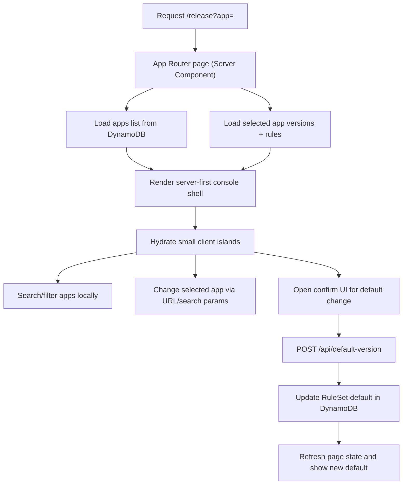

# refactor: rebuild release console

## Overview

Rebuild the MicroApps release console as a lean, server-first Next.js app that keeps the existing deployment model but replaces the current heavy UI stack, client-state architecture, and dated presentation. The new console should feel terminal-inspired and polished, ship dramatically less client JavaScript, and make browsing plus default-version changes safer and clearer.

## Problem Frame

The current app is an internal operator tool with a small data model but a disproportionate frontend footprint. It uses an old Next.js Pages Router setup, Redux, Carbon, styled-components, and large table dependencies to render a workflow that is fundamentally "browse apps, inspect versions/rules, and confirm a default-version change." The rebuild should preserve that core job while aligning with the origin requirements' performance, design, and scope constraints (see origin: `docs/brainstorms/2026-04-04-microapps-release-console-rebuild-requirements.md`).

## Requirements Trace

- R1, R2, R3. Deliver a terminal-inspired, polished, compact console that still reads as an operator tool.
- R4, R5, R6, R7. Make app browsing, selection, search/filtering, default visibility, and operational metadata easier to scan from one main workflow.
- R8, R9, R10. Keep default-version mutation in the main flow but require explicit confirmation and refresh the visible state after a successful change.
- R11, R12. Treat client bundle size, startup speed, and dependency discipline as first-order constraints.

## Scope Boundaries

- Keep the product surface close to the current app: browse applications, inspect versions and rules, and change the default version.
- Preserve the existing MicroApps deployment contract: Next.js standalone server output, versioned static assets, Lambda-hosted app server, and the existing DynamoDB data model.
- Do not add broader release-management features such as create/delete/deploy/version lifecycle actions.
- Do not change the underlying DynamoDB schema or MicroApps routing model.
- Do not require a framework migration away from Next.js for v2.

## Context & Research

### Relevant Code and Patterns

- `packages/app/next.config.js` already preserves the critical MicroApps contract: `basePath` at `/release`, `assetPrefix` with a `0.0.0` placeholder, custom build ID generation, and `output: 'standalone'`.
- `packages/app/src/pages/index.tsx`, `packages/app/src/store/main/index.ts`, and `packages/app/src/pages/api/refresh.ts` show that the current UI is mostly a thin console over app, version, and rule records. The complexity is architectural weight, not product depth.
- `packages/app/src/utils/dbManager.ts` shows the app currently reads and writes DynamoDB directly on the server using `@pwrdrvr/microapps-datalib`.
- `packages/cdk-construct/src/index.ts` packages the app as a standalone Next.js server under Lambda and injects `DATABASE_TABLE_NAME`, so the new plan should preserve server-side data access and standalone output.
- `.github/workflows/r_build-app.yml` and `.github/workflows/ci.yml` show the packaging pipeline depends on `.next/standalone`, copied static assets, and version substitution in `next.config.js`.
- The MicroApps platform documentation and CLI behavior confirm the runtime supports both Next.js apps and static apps. For this refactor, keeping Next.js is a product choice, not a platform limit.
- AWS inspection on 2026-04-04 shows the deployed production Lambda `microapps-core-ghpublic-app-release-prod` in `us-east-2` is a Zip package on `nodejs16.x` with `CodeSize` `2,874,282` bytes. Downloading the equivalent app package shows roughly `13 MB` uncompressed, with most server weight in `.next/server/chunks` plus traced `node_modules`.
- No live PR Lambdas matching `microapps-core-ghpublic-app-release-prod-pr-*` were present in the Lambda function inventory on 2026-04-04, so local workflow reproduction is still the best available PR-size proxy for package-size comparisons.
- Reproducing the current build workflow locally on 2026-04-04 produced a combined app artifact of `3,554,592` bytes and a Lambda-relevant `server-only.zip` of `2,556,331` bytes, with about `13 MB` uncompressed server content and `7.2 MB` uncompressed static assets.
- CloudWatch logs for `/aws/lambda/microapps-core-ghpublic-app-release-prod` do contain current runtime evidence. In the three hours before 2026-04-04 22:50 UTC, recent cold starts showed `Init Duration` values between about `1281.55 ms` and `1694.77 ms`, while warm requests in the same window completed in roughly `30-186 ms`.
- The correct production log group and function names are stable enough to record in planning context: function `microapps-core-ghpublic-app-release-prod`, log group `/aws/lambda/microapps-core-ghpublic-app-release-prod`, region `us-east-2`. The plan should reference those names directly and avoid embedding the AWS account ID.

### Institutional Learnings

- No `docs/solutions/` directory exists in this repository, so there are no local institutional learnings to carry forward.

### External References

- Next.js official App Router migration guidance recommends using Server Components by default and keeping Client Components narrow: [nextjs.org/docs/app/guides/migrating/app-router-migration](https://nextjs.org/docs/app/guides/migrating/app-router-migration)
- Next.js production guidance explicitly calls out Server Components as having no client-side JavaScript bundle impact: [nextjs.org/docs/app/guides/production-checklist](https://nextjs.org/docs/app/guides/production-checklist)
- Next.js standalone output remains the supported self-hosting packaging model for minimal deploy artifacts: [nextjs.org/docs/app/api-reference/config/next-config-js/output](https://nextjs.org/docs/app/api-reference/config/next-config-js/output)
- Next.js lazy-loading guidance supports deferring optional interactive UI with `next/dynamic`: [nextjs.org/docs/app/guides/lazy-loading](https://nextjs.org/docs/app/guides/lazy-loading)
- Tailwind CSS remains a zero-runtime styling approach and supports design-token theming through CSS variables: [tailwindcss.com/docs/theme](https://tailwindcss.com/docs/theme)

## Key Technical Decisions

- Use the Next.js App Router with Server Components as the default rendering model.
  Rationale: This gives the biggest performance win while staying on the existing Next.js deployment path. It also lets app/version/rule reads stay on the server instead of hydrating a client data layer.

- Keep read paths server-rendered and URL-driven; keep write paths explicit and server-side.
  Rationale: The selected app can live in search params so the main screen is linkable and server-rendered. The default-version mutation should remain an explicit POST boundary so it is easy to reason about, test, and preserve if the UI ever moves toward a static SPA plus API shape later.

- Preserve the current versioned static-asset and base-path contract instead of redesigning the MicroApps routing topology.
  Rationale: The existing `basePath`, `assetPrefix`, build-ID placeholder, and standalone output are intertwined with CI packaging and the MicroApps runtime. Preserving them keeps the refactor focused on the console, not the platform.

- Replace Carbon, Redux, styled-components, and table-heavy client dependencies with Tailwind CSS plus a tightly-scoped set of `shadcn/ui` primitives.
  Rationale: The requirements call for a terminal-inspired UI with low carrying cost. Tailwind plus selected primitives gives fast styling iteration without shipping a large general-purpose component framework.

- Set an explicit frontend performance budget for the rebuilt route.
  Rationale: "Keep it small" is too fuzzy to enforce. The rebuild should target an initial `/release` client payload of roughly <= 250 KB gzipped JavaScript, ship no browser bundle references to AWS SDK or `@pwrdrvr/microapps-datalib`, and record artifact sizes during verification so regressions are visible.

- Set an explicit Lambda package-size guardrail based on the current production artifact.
  Rationale: For cold-start-sensitive deploys, the server package matters more than the combined build artifact. The current production baseline is `2,874,282` bytes compressed, so the plan should target staying at or below that size and treat growth beyond roughly 10% (`~3.16 MB`) as an explicit review gate rather than an incidental regression.

- Treat cold-start validation as a fresh PR verification activity rather than a historical baseline exercise.
  Rationale: We now have a current production cold-start sample from the correct log group, but the retention window is still only 30 days. The reliable path is to compare PR deploy behavior against the observed current-prod envelope and capture new cold-start evidence during or immediately after the rebuilt PR deploy while the logs still exist.

## Open Questions

### Resolved During Planning

- Which Next.js architecture should v2 use?
  Resolution: App Router with Server Components by default, with only the search/filter UI, selection interactions, and confirm dialog hydrated as Client Components.

- How should the default-version mutation boundary work?
  Resolution: Keep reads on the server-rendered page and implement the mutation as a dedicated App Router route handler that updates DynamoDB and returns success/failure details; the client dialog should POST only after explicit confirmation and then trigger a refresh of the current page state.

- What should happen when the page loads without an explicit selected app?
  Resolution: Preserve current operator bias by selecting `release` when it exists; otherwise fall back to the first app in the sorted result set.

- How should the rebuild handle performance budgets?
  Resolution: Treat client payload size as a tracked acceptance criterion, with a target of <= 250 KB gzipped initial JavaScript for the main route and zero browser-bundled AWS/data access libraries.

- How should package-size risk be handled for Lambda cold starts?
  Resolution: Track both the combined app artifact and the Lambda-relevant server-only zip, but gate cold-start-sensitive regressions on the server package. Use `2,874,282` bytes as the current production compressed baseline and require explicit review if a PR deploy grows the server package by more than about 10%.

- How should cold-start performance be verified if historical logs are no longer retained?
  Resolution: Add a post-deploy verification step that records the deployed Lambda `CodeSize`, triggers a controlled smoke request against the PR deployment, and immediately inspects the PR Lambda log group for `Init Duration` while the evidence is fresh. Use the current production envelope from `microapps-core-ghpublic-app-release-prod` in `us-east-2` as the comparison point: about `1.28-1.69 s` init time and `30-186 ms` warm request duration in the sampled 2026-04-04 window.

### Deferred to Implementation

- Exact component naming and folder granularity inside the new `release-console` feature area.
  Why deferred: This should follow the real shape of the implementation once the new UI primitives are in place, not be over-specified in the plan.

- Whether the confirmation panel should be a modal dialog or slide-over panel.
  Why deferred: The requirements only need an explicit confirmation step. The exact presentation can be chosen during implementation once the visual system is established.

## High-Level Technical Design

> *This illustrates the intended approach and is directional guidance for review, not implementation specification. The implementing agent should treat it as context, not code to reproduce.*



## Implementation Units

- [ ] **Unit 1: Modernize the app foundation**

**Goal:** Replace the current app-level dependency and routing foundation with a modern Next.js baseline that supports App Router, Tailwind, and a small-client-footprint architecture.

**Requirements:** R1, R2, R3, R11, R12

**Dependencies:** None

**Files:**
- Modify: `packages/app/package.json`
- Modify: `packages/app/package-lock.json`
- Modify: `packages/app/next.config.js`
- Modify: `packages/app/tsconfig.json`
- Create: `packages/app/postcss.config.mjs`
- Create: `packages/app/components.json`
- Create: `packages/app/src/app/layout.tsx`
- Create: `packages/app/src/app/globals.css`
- Test: `packages/app/tests/next-config.contract.test.ts`

**Approach:**
- Upgrade `packages/app` to a current supported Next.js App Router stack and remove heavy runtime dependencies that are no longer needed for v2.
- Keep `output: 'standalone'`, `basePath`, `assetPrefix`, and build-ID versioning intact so the packaging pipeline and MicroApps runtime contract remain stable.
- Introduce Tailwind and the minimal `shadcn/ui` configuration needed to support the new design system, but avoid broad component generation or unnecessary plugins.
- Leave Storybook and JSII concerns untouched unless they block the app upgrade directly; the first pass should prioritize runtime simplicity over wider repo cleanup.

**Patterns to follow:**
- `packages/app/next.config.js`
- `packages/cdk-construct/src/index.ts`
- `.github/workflows/r_build-app.yml`

**Test scenarios:**
- Happy path: the updated Next config still resolves `/release` as the app base path and continues to emit versioned asset URLs using the `0.0.0` placeholder convention before version substitution.
- Edge case: the standalone build still emits a `.next/standalone` server output that can be copied into the CDK package layout without requiring the full workspace install at runtime.
- Error path: removed legacy UI dependencies are not referenced by the rebuilt app entrypoints, avoiding accidental client bundle inclusion through stale imports.

**Verification:**
- The app can build in standalone mode with the new dependency set, and the resulting config/build artifacts still satisfy the current MicroApps packaging assumptions.

- [ ] **Unit 2: Move reads into a server-first release-console feature**

**Goal:** Replace the current Pages Router + Redux + API-refresh architecture with an App Router page that renders app, version, and rule data on the server.

**Requirements:** R4, R5, R6, R7, R11, R12

**Dependencies:** Unit 1

**Files:**
- Create: `packages/app/src/app/page.tsx`
- Create: `packages/app/src/lib/release-console/load-console-data.ts`
- Create: `packages/app/src/lib/release-console/normalize-records.ts`
- Create: `packages/app/src/lib/release-console/types.ts`
- Create: `packages/app/src/lib/dbManager.ts`
- Remove: `packages/app/src/pages/index.tsx`
- Remove: `packages/app/src/store/main/index.ts`
- Remove: `packages/app/src/store/reducer.ts`
- Remove: `packages/app/src/store/store.ts`
- Remove: `packages/app/src/pages/api/refresh.ts`
- Remove: `packages/app/src/pages/api/refresh/[appName].ts`
- Remove: `packages/app/src/pages/api/allApps.ts`
- Test: `packages/app/src/lib/release-console/load-console-data.test.ts`

**Approach:**
- Create a dedicated server-side feature layer that reads all apps plus the selected app's versions and rules from DynamoDB via `@pwrdrvr/microapps-datalib`.
- Drive selected-app state from URL search params so browsing stays linkable and server-rendered without a client-side global store.
- Normalize DynamoDB records into console-friendly view models on the server, including derived fields for "current default version" and operator-facing metadata display.
- Preserve the current default selection behavior by preferring `release` when no `app` param is present.

**Patterns to follow:**
- `packages/app/src/utils/dbManager.ts`
- The existing `@pwrdrvr/microapps-datalib` application, rules, and version model APIs already used by this repo

**Test scenarios:**
- Happy path: loading with no `app` search param returns a sorted app list, selects `release` when present, and includes the selected app's versions and rules in one server-rendered payload.
- Happy path: loading with `?app=blog` returns `blog` as the selected app and marks the `default` rule's `SemVer` as the current default version in the normalized data.
- Edge case: when `release` is absent, the first sorted app becomes the selected app instead of failing or rendering an empty console.
- Edge case: when an app has no rules record or no versions, the loader returns an empty-state shape rather than throwing.
- Error path: DynamoDB read failures are surfaced as a recoverable server-rendered error state that does not attempt any client-side retry loop.

**Verification:**
- The main page renders the complete browse/read view from server data alone, with no client-side refresh endpoint required for initial or selected-app reads.

- [ ] **Unit 3: Build the terminal-inspired browse-first UI**

**Goal:** Implement the new visual system and interaction model for browsing apps, versions, rules, and operational metadata with minimal client-side hydration.

**Requirements:** R1, R2, R3, R4, R5, R6, R7, R11, R12

**Dependencies:** Unit 2

**Files:**
- Create: `packages/app/src/components/release-console/ReleaseConsoleShell.tsx`
- Create: `packages/app/src/components/release-console/AppListClient.tsx`
- Create: `packages/app/src/components/release-console/VersionTable.tsx`
- Create: `packages/app/src/components/release-console/RulePanel.tsx`
- Create: `packages/app/src/components/release-console/AppMetadataPanel.tsx`
- Create: `packages/app/src/components/release-console/SearchInput.tsx`
- Create: `packages/app/src/app/manifest.ts`
- Remove: `packages/app/src/pages/_document.tsx`
- Remove: `packages/app/src/pages/api/webmanifest.ts`
- Modify: `packages/app/public/static/*`
- Test: `packages/app/src/components/release-console/AppListClient.test.tsx`
- Test: `packages/app/src/components/release-console/ReleaseConsoleShell.test.tsx`

**Approach:**
- Build a terminal-inspired design system in `globals.css` using Tailwind theme tokens and CSS variables for typography, surface colors, borders, and status accents.
- Keep interactive code narrow: the search/filter input, app-selection list behavior, and optional lazy-loaded confirm UI should be the main Client Components. Versions, rules, and metadata panels can remain server-rendered where practical.
- Replace the current table-heavy UI with simpler semantic layouts that still read densely on laptop-sized screens.
- Use App Router metadata conventions (`manifest.ts` and layout metadata) instead of custom document/webmanifest routes where possible.
- Show the current default version as a first-class state in the versions view and make status/type/startup metadata immediately scannable.

**Patterns to follow:**
- `packages/app/public/static/*`
- Next.js App Router metadata conventions from official docs
- Tailwind theme-variable guidance from official docs

**Technical design:** *(directional guidance, not implementation specification)*

```text
Left rail: searchable app list
Main pane: selected app summary + version table
Side pane / lower pane: rules and operational metadata

Hydrated islands:
- app search + local filter
- app selection interaction
- confirm trigger state

Server-rendered content:
- versions table rows
- current default indicators
- rules summary
- metadata summaries
```

**Test scenarios:**
- Happy path: typing into the search input filters the visible app list without round-tripping to the server and preserves the currently selected app when it still matches.
- Happy path: selecting a new app updates the URL/search params and re-renders the selected app's data while keeping the layout stable.
- Edge case: the current default version is visually distinct even when the selected app has many versions or only a single version.
- Edge case: the layout remains readable at common laptop widths without pushing critical controls below the fold unnecessarily.
- Integration: the metadata panel shows type, startup type, status, and URL details from the normalized server payload without requiring a second fetch path.

**Verification:**
- The rebuilt screen feels materially more polished than the current console and supports browse/select/inspect workflows without relying on a large hydrated client app.

- [ ] **Unit 4: Add the confirmed default-version mutation flow**

**Goal:** Implement a safe, explicit change-default workflow that requires confirmation, persists only after confirmation, and refreshes the visible state immediately after success.

**Requirements:** R8, R9, R10, R11

**Dependencies:** Unit 2, Unit 3

**Files:**
- Create: `packages/app/src/app/api/default-version/route.ts`
- Create: `packages/app/src/components/release-console/ConfirmDefaultChange.tsx`
- Create: `packages/app/src/lib/release-console/update-default-version.ts`
- Test: `packages/app/src/app/api/default-version/route.test.ts`
- Test: `packages/app/src/components/release-console/ConfirmDefaultChange.test.tsx`

**Approach:**
- Add a dedicated POST route handler that validates the target app/version pair, calls `Application.UpdateDefaultRule`, and returns structured success/failure payloads.
- Trigger the route only from an explicit confirmation UI; opening or changing the candidate selection must not mutate state.
- Disable mutation affordances for the already-default version so the UI communicates when no action is needed.
- On success, refresh the current page state and show an immediate visible default-version update; on failure, keep the operator on the current screen with a clear error message and no silent partial state.

**Patterns to follow:**
- `packages/app/src/pages/api/update/default/[appName]/[semVer].ts`
- The existing `@pwrdrvr/microapps-datalib` mutation API already used by this repo

**Test scenarios:**
- Happy path: confirming a non-default version posts the selected `appName` and `semVer`, updates the `default` rule in DynamoDB, and refreshes the UI to show the new default.
- Edge case: cancelling the confirmation leaves the current default untouched and does not emit any network mutation request.
- Edge case: the currently-default version cannot open a misleading confirm path that suggests a no-op mutation is available.
- Error path: posting an invalid app/version combination returns a client-visible error and leaves the current default unchanged.
- Error path: a DynamoDB write failure returns an error response, preserves the pre-change UI state, and avoids showing a false success state.
- Integration: after success, the server-rendered read path shows the new default without requiring a custom client-side cache invalidation layer.

**Verification:**
- Operators can safely change the default version from the main screen, and the UI makes it obvious that persistence only happens after explicit confirmation.

- [ ] **Unit 5: Align packaging, CI, and release artifacts with the rebuild**

**Goal:** Update the repo's build, packaging, and deployment surfaces so the new app stack is compatible with the existing Lambda/CDK release path.

**Requirements:** R11, R12

**Dependencies:** Unit 1, Unit 2, Unit 3, Unit 4

**Files:**
- Modify: `packages/cdk-construct/src/index.ts`
- Modify: `.github/workflows/ci.yml`
- Modify: `.github/workflows/r_build-app.yml`
- Modify: `.github/workflows/release.yml`
- Modify: `packages/app/run.sh`
- Modify: `packages/cdk-construct/README.md`
- Modify: `packages/cdk-stack/README.md`
- Test: `packages/app/tests/build-artifact.contract.test.ts`

**Approach:**
- Lift Lambda runtime and CI Node versions to a modern LTS line supported by the chosen Next.js release, rather than trying to run a modern App Router build on the current Node 16 assumptions.
- Keep the packaging layout the same from the CDK construct's perspective: static assets copied into the construct payload, standalone server output copied into the Lambda bundle, and version substitution applied before packaging.
- Update build verification to record artifact sizes that matter for the rebuild goals, especially the main route's client JavaScript footprint, the combined build artifact size, and the Lambda-relevant server-only zip size.
- Add an explicit comparison against the current production server-package baseline (`2,874,282` bytes compressed) so PR builds surface Lambda-size regressions before deploy.
- Add a deploy-time smoke verification note for PR environments: after the PR Lambda is live, hit the deployed app once and immediately query its log group for `Init Duration` so cold-start evidence is captured before log retention wipes it out. Compare that result to the current production envelope from `microapps-core-ghpublic-app-release-prod` in `us-east-2`.
- Refresh README-level documentation so the repository no longer describes the console as a bare-bones example after the rebuild lands.

**Execution note:** Add characterization coverage around the packaging contract before changing workflow or runtime assumptions so the refactor cannot silently break deployability.

**Patterns to follow:**
- `packages/cdk-construct/src/index.ts`
- `.github/workflows/r_build-app.yml`
- `.github/workflows/ci.yml`
- `.github/workflows/release.yml`

**Test scenarios:**
- Happy path: the CI build still produces the zipped app artifact expected by downstream release steps after the app-router rebuild.
- Edge case: the standalone server artifact still starts through `run.sh` under the updated Lambda runtime without requiring workspace-only files at runtime.
- Edge case: version substitution still rewrites the `0.0.0` placeholder so static assets remain rooted under the versioned S3 path used by MicroApps.
- Error path: if a future dependency accidentally reintroduces a large client bundle or browser-side AWS import, the artifact verification step catches the regression before release.
- Error path: if the rebuilt server-only package exceeds the current production baseline by more than about 10%, the build surfaces that regression as a release-risk signal rather than silently accepting the size increase.
- Integration: after a PR deploy, querying the deployed Lambda `CodeSize` shows whether the real AWS package stayed within the expected envelope compared to `microapps-core-ghpublic-app-release-prod`.
- Integration: after a PR deploy, a controlled first-hit smoke request plus immediate log inspection captures whether the deployed PR Lambda emitted an `Init Duration` line and how that init latency compares to the current production sample range of roughly `1.28-1.69 s`.
- Integration: the CDK construct continues to deploy a Lambda-backed app that reads and writes the existing MicroApps DynamoDB table without any schema changes.

**Verification:**
- The rebuilt console can move through the existing CI/CD and CDK packaging path without becoming a one-off local-only app, and the Lambda-relevant package size remains within the agreed cold-start guardrail.

## System-Wide Impact

- **Interaction graph:** Browser request -> Next.js App Router page -> DynamoDB read helpers -> server-rendered console; browser confirmation -> App Router mutation route -> `Application.UpdateDefaultRule` -> refreshed server read path.
- **Error propagation:** Read failures should surface as operator-visible error panels on the page. Mutation failures should return explicit error payloads and be rendered as non-destructive UI feedback instead of silent retries.
- **State lifecycle risks:** The most important lifecycle risk is stale default-version state after a write. The plan intentionally uses refresh-through-server-read to avoid maintaining a separate client cache that can drift from DynamoDB.
- **API surface parity:** The plan preserves the externally meaningful surfaces: `/release` base path, versioned asset URLs, standalone server packaging, and the existing DynamoDB application/version/rules schema.
- **Integration coverage:** Unit-level tests alone will not prove the packaging contract. Verification must cover the built app artifact, standalone server layout, and version-substitution assumptions used by CI and CDK.
- **Unchanged invariants:** The MicroApps routing topology, deployer integration, and DynamoDB schema remain unchanged; the refactor is intentionally a console/UI modernization on top of the same platform contract.

## Risks & Dependencies

| Risk | Mitigation |
|------|------------|
| Modern Next.js requires newer Node runtime support than the repo currently assumes | Upgrade CI and Lambda runtime in the same plan, and treat runtime compatibility as part of the packaging unit rather than a postscript |
| App Router migration could accidentally break the existing versioned asset/basePath behavior | Preserve the current `next.config.js` contract, add characterization tests around config/build output, and verify version substitution before packaging |
| Tailwind + `shadcn/ui` could sprawl into a new design-system dependency problem | Limit generated primitives to the components actually used by the console and keep theme tokens centralized in app CSS |
| Server package growth could worsen Lambda cold starts even if the UI gets nicer | Measure server-only compressed size in CI, compare it to the current `2,874,282` byte production baseline, and require explicit review for regressions beyond about 10% |
| A rebuilt package could keep zip size flat but still regress initialization time | Capture `Init Duration` from the PR Lambda immediately after deploy and compare it to the current production sample range from `/aws/lambda/microapps-core-ghpublic-app-release-prod` |
| The repo currently has little app-level test coverage | Add focused tests around data shaping, browse interactions, mutation confirmation, and packaging contracts instead of trying to backfill broad low-value coverage |
| README/workflow docs can drift from the new app architecture | Update docs and artifact expectations in the final packaging/docs unit, not as an afterthought |

## Documentation / Operational Notes

- Update the package README content in `packages/cdk-construct/README.md` and `packages/cdk-stack/README.md` to reflect the rebuilt console's capabilities, architecture, and deploy expectations.
- Replace stale screenshots or demo assets once the new UI lands so reviewers and consumers see the new experience rather than the legacy Carbon-based UI.
- Capture before/after client bundle and packaged artifact sizes during implementation so the refactor has measurable performance proof, not just design claims.
- Include the deployed Lambda `CodeSize` in PR verification notes when available so local artifact estimates and real AWS package sizes can be compared directly.
- Record the exact function name, log group name, and region in PR verification notes when capturing cold-start evidence: `microapps-core-ghpublic-app-release-prod`, `/aws/lambda/microapps-core-ghpublic-app-release-prod`, `us-east-2`.
- Because the current log-retention window is only 30 days, treat `Init Duration` capture as part of the PR verification checklist rather than something to reconstruct later.

## PR Verification Matrix

| Stage | Evidence to capture | Expected result | Review trigger |
|------|---------------------|-----------------|----------------|
| Local or CI artifact build | Main-route client JavaScript size | <= `250 KB` gzipped target for the `/release` route | Client route materially exceeds target or includes browser-bundled AWS/data libraries |
| Local or CI artifact build | Lambda-relevant `server-only.zip` size | Preferred: <= `2,874,282` bytes compressed | Required review if > `3,161,710` bytes compressed (about 10% above prod baseline) |
| Local or CI artifact build | Combined packaged app artifact size | Recorded for trend visibility only | Large unexpected jump relative to the current `3,554,592` byte local reference build |
| PR deploy in `us-east-2` | Deployed PR Lambda `CodeSize` | Close to CI/server-only expectations | Real deployed size diverges materially from build artifact or exceeds the review threshold |
| PR deploy in `us-east-2` | Fresh `REPORT` lines from `/aws/lambda/microapps-core-ghpublic-app-release-prod-pr-<PR_NUMBER>` after a controlled smoke hit | `Init Duration` broadly in the current-prod envelope of about `1.28-1.69 s`; warm durations broadly within `30-186 ms` | Any observed init above about `2.0 s`, or warm durations consistently worse than the current-prod envelope without a clear explanation |
| PR review note | Recorded function name, log group, region, deployed `CodeSize`, sampled `Init Duration`, sampled warm duration | Complete evidence package for reviewers | Missing runtime evidence, making cold-start claims unreviewable |

### PR Verification Checklist

- Before deploy, record the build-time artifacts that matter:
  - main-route client JavaScript footprint
  - combined packaged app artifact size
  - Lambda-relevant `server-only.zip` size
- After the PR deployment is live, identify the exact PR Lambda using the established naming pattern:
  - function: `microapps-core-ghpublic-app-release-prod-pr-<PR_NUMBER>`
  - log group: `/aws/lambda/microapps-core-ghpublic-app-release-prod-pr-<PR_NUMBER>`
  - region: `us-east-2`
- Record the deployed Lambda `CodeSize` and compare it to:
  - the current production baseline of `2,874,282` bytes
  - the PR build's `server-only.zip` size
- Trigger a controlled smoke request against the freshly deployed PR app with a unique query value so the verification window is easy to correlate in logs.
- Immediately inspect the PR Lambda `REPORT` lines from that verification window and capture:
  - whether an `Init Duration` line appeared
  - the sampled init time
  - the sampled warm request duration from subsequent requests in the same window
- Treat the verification as complete only when the PR note includes all of:
  - artifact sizes
  - deployed `CodeSize`
  - sampled cold-start evidence
  - sampled warm-request evidence
  - a short conclusion stating whether the PR stayed inside or outside the expected envelope

### Regression Interpretation

- **Pass:** server package stays within the preferred size envelope and sampled init behavior looks comparable to current production.
- **Warn:** package size is still below the hard review threshold, but init time trends noticeably above the current-prod sample range or warm durations look meaningfully slower.
- **Escalate:** server package exceeds the 10% size guardrail, or sampled init duration crosses about `2.0 s` without an intentional tradeoff and mitigation note.

## Sources & References

- **Origin document:** [docs/brainstorms/2026-04-04-microapps-release-console-rebuild-requirements.md](docs/brainstorms/2026-04-04-microapps-release-console-rebuild-requirements.md)
- Related code: `packages/app/next.config.js`
- Related code: `packages/app/src/pages/index.tsx`
- Related code: `packages/app/src/pages/api/update/default/[appName]/[semVer].ts`
- Related code: `packages/cdk-construct/src/index.ts`
- Related code: `.github/workflows/r_build-app.yml`
- Related package: `@pwrdrvr/microapps-datalib`
- External docs: [Next.js App Router migration](https://nextjs.org/docs/app/guides/migrating/app-router-migration)
- External docs: [Next.js production checklist](https://nextjs.org/docs/app/guides/production-checklist)
- External docs: [Next.js standalone output](https://nextjs.org/docs/app/api-reference/config/next-config-js/output)
- External docs: [Tailwind theme variables](https://tailwindcss.com/docs/theme)
