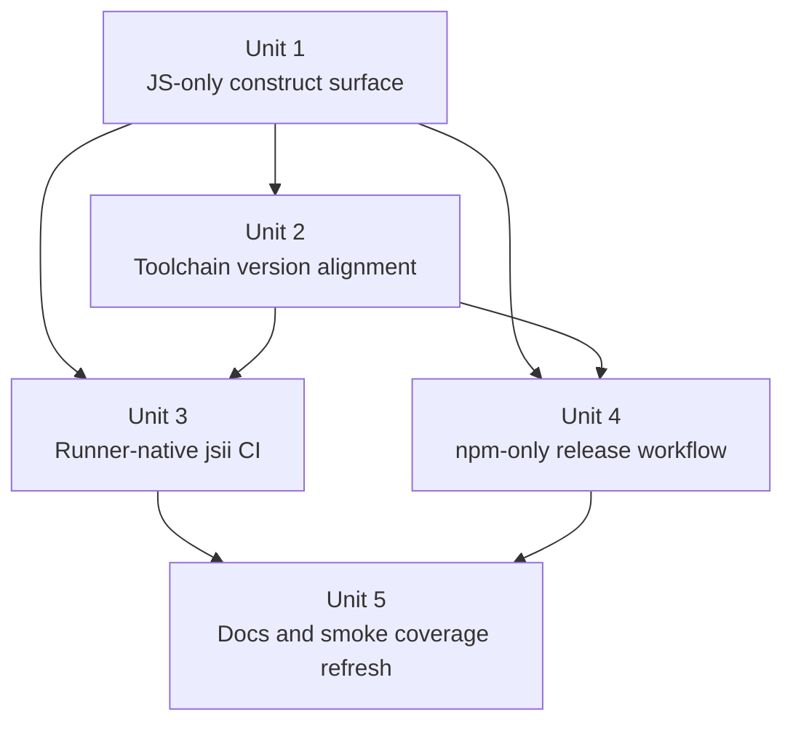

# Refactor jsii packaging to a JavaScript-only release surface and modern toolchain

## Overview

Simplify the CDK construct build and release path by removing `jsii-superchain`, stopping publication of Python/.NET/Java artifacts, retaining `projen` and `jsii` as the source of truth for the JavaScript construct package, and upgrading the jsii/CDK/AWS SDK toolchain to a current coherent baseline. The refactor preserves the existing app-artifact bundling model so the published npm construct still contains the built Next.js application payload.

## Problem Frame

The repo now has a modern pnpm/Node 22 baseline, but its construct automation is still carrying the old multi-language jsii release shape:

- `packages/cdk-construct/.projenrc.js` and `packages/cdk-construct/package.json` still define Java, Python, and .NET jsii targets
- `.github/workflows/jsii.yml` and `.github/workflows/release.yml` still depend on `public.ecr.aws/jsii/superchain:1-bookworm-slim`
- `.github/workflows/release.yml` still publishes PyPI, NuGet, Maven Central, and npm artifacts even though the only known in-company consumer is using the JavaScript construct
- `packages/cdk-construct/README.md` and `README.md` still advertise the construct as a multi-language package

That shape creates extra CI brittleness, extra release secrets and external systems, and extra generated metadata that no longer appears justified by current usage. At the same time, this repo cannot simply copy `microapps-core` blindly: it still has a repo-specific packaging seam where `.github/workflows/r_build-app.yml` materializes the built Next.js app into `packages/cdk-construct/lib/microapps-app-release/` before construct packaging happens. The plan therefore narrows the public package surface while preserving that app bundling behavior.

## Requirements Trace

- R1. Remove `jsii-superchain` from this repo's CI and release workflows.
- R2. Simplify the construct package to a JavaScript/TypeScript release surface and stop generating or publishing Python, .NET, and Java artifacts.
- R3. Keep `projen` and `jsii` as the source of truth for the construct build, API docs, and npm package output.
- R4. Preserve the existing release behavior that bundles the built app artifact into `packages/cdk-construct/lib/microapps-app-release/` before the construct package is produced.
- R5. Upgrade the repo's jsii/projen/CDK/AWS SDK baselines to a current, internally consistent set of versions.
- R6. Update tests, docs, and maintainer release guidance so the simplified release surface is explicit and durable.

## Scope Boundaries

- This plan does not change app features, UI behavior, or DynamoDB interactions.
- This plan does not introduce a new packaging channel for non-JavaScript consumers; it intentionally removes those channels.
- This plan does not require a Next.js or Storybook major-version migration unless a narrow supporting bump becomes necessary during execution.
- This plan does not change the construct package name or the app-artifact layout inside `packages/cdk-construct/lib/`.

## Context & Research

### Relevant Code and Patterns

- `packages/cdk-construct/.projenrc.js` is the source of truth for jsii targets, build scripts, and version policy for the construct package.
- `packages/cdk-construct/package.json` is generated from projen and still exposes `build:jsii-all`, `package:python`, `package:java`, and `package:dotnet`.
- `.github/workflows/jsii.yml` currently label-gates a runner job but still executes inside a `jsii-superchain` container.
- `.github/workflows/release.yml` still injects the built app artifact into `packages/cdk-construct/lib/`, runs `build:jsii-all`, and then publishes four language targets.
- `.github/workflows/r_build-app.yml` already encapsulates the repo-specific Next.js standalone materialization logic and should remain the upstream app-artifact source for releases.
- `tests/workflows/node22-release-smoke.test.mjs` already protects workflow conventions such as Node 22, label triggers, prerelease propagation, and the current superchain usage.
- `tests/package-manager/cdk-construct-projen-smoke.test.mjs` already protects the construct package's pnpm/projen/CDK baseline and is the natural place to assert the simplified JS-only package surface.
- `packages/cdk-construct/README.md`, `README.md`, and `.agents/skills/release/SKILL.md` all describe the public or maintainer-facing release surface and will drift if they are not updated alongside the workflow change.

### Institutional Learnings

- There is no `docs/solutions/` history in this repo for jsii packaging, so the best local prior art is the existing release-alignment work in `docs/plans/2026-04-04-001-refactor-pnpm-node22-release-alignment-plan.md`.
- That earlier plan intentionally preserved multi-language jsii publishing as part of the stabilization pass. This plan is a follow-on simplification pass that narrows scope after the Node 22/pnpm/projen migration succeeded.
- Observed upstream behavior in `microapps-core` is directionally useful: it no longer uses `jsii-superchain` in workflows and no longer releases non-npm artifacts, but it still retains multi-language jsii metadata in package configuration. This repo can simplify further because the desired outcome here is explicitly a JavaScript-only construct surface.

### External References

- Planning-time npm registry lookups on 2026-04-05:
  - `projen`: 0.99.34
  - `aws-cdk-lib`: 2.248.0
  - `aws-cdk`: 2.1117.0
  - `constructs`: 10.6.0
  - `jsii`: 5.9.36
  - `jsii-rosetta`: 5.9.38
  - `jsii-pacmak`: 1.127.0
  - `jsii-diff`: 1.127.0
  - `jsii-docgen`: 10.11.15
  - `@aws-sdk/client-dynamodb`: 3.1024.0
  - `@aws-sdk/lib-dynamodb`: 3.1024.0
- Package references:
  - https://www.npmjs.com/package/projen
  - https://www.npmjs.com/package/aws-cdk-lib
  - https://www.npmjs.com/package/jsii
  - https://www.npmjs.com/package/@aws-sdk/client-dynamodb

## Key Technical Decisions

- Remove the non-JavaScript jsii targets from the projen source, not just from release publishing.
  Rationale: leaving `publishToPypi`, `publishToNuget`, and `publishToMaven` in `packages/cdk-construct/.projenrc.js` would preserve dead config, keep misleading generated metadata, and continue to bias the package scripts toward multi-language pacmak behavior.

- Treat this simplification as a public package-surface reduction that deserves explicit breaking-change communication.
  Rationale: even if no current internal user is known to rely on Python/.NET/Java artifacts, those packages have been published publicly before. The implementation should therefore pair the removal with release-note callouts and a semver-major release recommendation unless a deliberate compatibility exception is chosen later.

- Replace the containerized `build:jsii-all` workflow shape with runner-native JavaScript-focused jsii validation.
  Rationale: once non-JS artifacts are removed, the repo no longer needs a containerized Python/Java/.NET toolchain. A normal Ubuntu runner with the existing Node bootstrap is the simpler and more maintainable path.

- Keep the app-artifact materialization flow unchanged and build the construct package around it.
  Rationale: the important product behavior here is not multi-language output; it is that the published npm construct continues to embed the packaged Next.js app. `.github/workflows/r_build-app.yml` is already the repo-specific mechanism for producing that artifact and should remain the upstream dependency for release packaging.

- Upgrade jsii/projen/CDK/AWS SDK versions as a coherent bundle, with projen owning the construct package versions and the app/root manifests aligning around that bundle.
  Rationale: independently maximizing versions would make it harder to reason about regressions. The plan should move the stack to a current line in one pass and let generated files reflect the chosen baseline consistently.

## Open Questions

### Resolved During Planning

- Should this repo mirror `microapps-core` exactly and keep multi-language jsii metadata while only stopping publication?
  No. The requested simplification here is stronger: remove the extra language targets entirely so the build surface matches the actual supported package surface.

- Should the repo preserve `jsii-superchain` as a fallback in CI or release?
  No. Once the construct package is JavaScript-only, keeping the container would just preserve obsolete complexity.

- Should the release workflow switch to a per-language fanout model like the one `microapps-core` uses in its main-build workflow?
  No. That fanout only made sense to support multiple target runtimes. This repo should simplify to a single runner-native construct packaging path.

### Deferred to Implementation

- Whether the first release after this refactor should be cut as a semver-major tag immediately or staged behind one final compatibility notice release.
  This is a release-management choice rather than a technical blocker, but the implementation should leave enough documentation for that decision to be made explicitly.

- Whether any generated `API.md` or README copy needs manual follow-up after projen/docgen regeneration to keep the JavaScript-only install story readable.
  The exact churn depends on the regenerated output and should be evaluated during implementation.

- Whether upgrading the app-side AWS SDK clients exposes any incidental linting or type adjustments in `packages/app`.
  That depends on the actual dependency diff and should be handled during execution rather than guessed in the plan.

## High-Level Technical Design

> *This illustrates the intended approach and is directional guidance for review, not implementation specification. The implementing agent should treat it as context, not code to reproduce.*

| Surface | Current state | Planned state |
|---|---|---|
| Construct metadata | Multi-language jsii targets in projen/package metadata | JavaScript-only jsii/projen metadata |
| PR validation | Runner job wrapped in `jsii-superchain` | Runner-native Node job using the repo's existing Node bootstrap |
| Release packaging | App artifact + `build:jsii-all` + PyPI/NuGet/Maven/npm publication | App artifact + JavaScript construct packaging + npm publication only |
| Maintainer docs | README and release skill still describe a multi-language package | Docs and release guidance explicitly describe npm-only support |

## Implementation Units

- [x] **Unit 1: Re-scope the construct package to a JavaScript-only supported surface**

**Goal:** Remove Python/.NET/Java targets from the construct package source of truth so the generated metadata, scripts, and docs match the intended supported package surface.

**Requirements:** R2, R3, R6

**Dependencies:** None

**Files:**
- Modify: `packages/cdk-construct/.projenrc.js`
- Modify: `packages/cdk-construct/package.json`
- Modify: `packages/cdk-construct/.projen/tasks.json`
- Modify: `packages/cdk-construct/.projen/deps.json`
- Modify: `packages/cdk-construct/README.md`
- Modify: `README.md`
- Modify: `tests/package-manager/cdk-construct-projen-smoke.test.mjs`

**Approach:**
- Remove `publishToPypi`, `publishToNuget`, and `publishToMaven` from the projen source and regenerate the construct package so generated metadata no longer implies multi-language support.
- Rename or replace misleading script names if necessary so the package no longer advertises "`all` languages" when it only packages the JavaScript surface.
- Update human-facing install documentation to state clearly that the supported construct package is npm-first JavaScript/TypeScript.

**Patterns to follow:**
- Existing projen-managed generation flow in `packages/cdk-construct/.projenrc.js`
- Existing package-surface smoke assertions in `tests/package-manager/cdk-construct-projen-smoke.test.mjs`

**Test scenarios:**
- Happy path: regenerated construct metadata contains the npm/jsii JavaScript package surface but no PyPI, NuGet, or Maven publication targets.
- Happy path: the construct package still exposes the expected JavaScript compile/docgen/package scripts after regeneration.
- Edge case: README regeneration removes stale multi-language install language without dropping the existing JavaScript install example.
- Integration: the projen smoke test fails if a future regeneration reintroduces non-JavaScript publish targets or misleading build scripts.

**Verification:**
- The projen source and generated construct package files describe one supported npm package surface, and no tracked repo docs still claim Python/.NET/Java distribution.

- [x] **Unit 2: Upgrade the jsii, projen, CDK, constructs, and AWS SDK baselines coherently**

**Goal:** Move the repo to a current, internally consistent toolchain line that matches the simplified construct surface.

**Requirements:** R3, R5

**Dependencies:** Unit 1

**Files:**
- Modify: `packages/cdk-construct/.projenrc.js`
- Modify: `packages/cdk-construct/package.json`
- Modify: `packages/cdk-stack/package.json`
- Modify: `packages/app/package.json`
- Modify: `package.json`
- Modify: `pnpm-lock.yaml`
- Modify: `tests/package-manager/cdk-construct-projen-smoke.test.mjs`

**Approach:**
- Choose a single version bundle anchored in current stable registry lines, with projen owning construct-package version declarations and the root/app packages aligning around that bundle.
- Upgrade `aws-cdk-lib`, `constructs`, `jsii`, `jsii-rosetta`, `jsii-pacmak`, `jsii-diff`, `jsii-docgen`, and `projen` together instead of in piecemeal follow-up commits.
- Upgrade the app's DynamoDB AWS SDK clients together so they remain paired on the same `3.x` line.
- Preserve existing Node 22 expectations and avoid bundling unrelated framework-major upgrades into this refactor unless a dependency constraint forces them.

**Patterns to follow:**
- Current version-floor assertions in `tests/package-manager/cdk-construct-projen-smoke.test.mjs`
- Existing package-manager/version alignment conventions already established in the root `package.json`

**Test scenarios:**
- Happy path: the construct projen smoke test reflects the new version floor and passes with the regenerated package metadata.
- Happy path: root and package manifests agree on the upgraded CDK/projen/jsii baseline without leaving mixed old/new ranges behind.
- Edge case: generated files remain stable if projen slightly normalizes version syntax during regeneration.
- Error path: if a chosen version combination is incompatible, the package smoke coverage points to the drifted manifest or generated file rather than masking it in lockfile noise.

**Verification:**
- The repo manifests and generated construct metadata point at one coherent modern toolchain line, and the lockfile reflects only that aligned dependency set.

- [x] **Unit 3: Replace the JSII PR workflow with runner-native JavaScript-focused validation**

**Goal:** Eliminate `jsii-superchain` from PR/main jsii validation while preserving the existing label-gated workflow semantics and documentation drift checks.

**Requirements:** R1, R3, R6

**Dependencies:** Units 1-2

**Files:**
- Modify: `.github/workflows/jsii.yml`
- Modify: `tests/workflows/node22-release-smoke.test.mjs`
- Modify: `tests/workflows/configure-nodejs-contract.test.mjs`

**Approach:**
- Remove the container stanza from `.github/workflows/jsii.yml` and keep the job on a normal Ubuntu runner using `./.github/actions/configure-nodejs`.
- Replace the old multi-language packaging command with the JavaScript-focused validation sequence produced by the simplified projen/package surface.
- Preserve the `BUILD-JSII` label gating and the "Confirm No Doc Changes" protection so package docs remain generated and checked in.
- Keep the workflow independent of release-only secrets or external language toolchains.

**Patterns to follow:**
- Existing label-trigger structure in `.github/workflows/jsii.yml`
- Existing workflow contract assertions in `tests/workflows/node22-release-smoke.test.mjs`

**Test scenarios:**
- Happy path: the jsii workflow still runs on push and on labeled PR events, and the gated job only executes for labeled PRs.
- Happy path: the workflow uses the shared Node bootstrap and contains no `jsii-superchain` container stanza.
- Edge case: future edits that reintroduce a container image or direct non-bootstrap install path are caught by workflow smoke coverage.
- Integration: the workflow still checks for generated doc drift after the JavaScript-focused packaging step completes.

**Verification:**
- The JSII workflow is fully runner-native, still label-gated, and still protects generated construct docs without requiring a containerized multi-language environment.

- [x] **Unit 4: Simplify release packaging to npm-only while preserving app-artifact bundling**

**Goal:** Remove non-JavaScript publish steps from the release workflow, keep the app-artifact injection path intact, and publish only the npm construct package.

**Requirements:** R1, R2, R4, R6

**Dependencies:** Units 1-2

**Files:**
- Modify: `.github/workflows/release.yml`
- Modify: `.github/workflows/r_build-app.yml`
- Modify: `tests/workflows/node22-release-smoke.test.mjs`
- Modify: `.agents/skills/release/SKILL.md`

**Approach:**
- Keep the existing reusable `build-app` job and artifact handoff intact so release packaging still starts from the repo's Next.js build output.
- Convert `build-cdk-construct` to a normal runner-native Node job that downloads the app artifact, applies the release version, and produces only the JavaScript construct distribution artifacts.
- Remove the PyPI, NuGet, and Maven publish steps, associated secret dependencies, and any superchain container usage from the release pipeline.
- Preserve prerelease-to-`npmDistTag` propagation and npm publish behavior exactly, since npm remains the only supported release channel.

**Patterns to follow:**
- Existing app-artifact handoff between `.github/workflows/r_build-app.yml` and `.github/workflows/release.yml`
- Existing prerelease metadata contract in `.github/workflows/r_version.yml`
- Existing release guidance in `.agents/skills/release/SKILL.md`

**Test scenarios:**
- Happy path: release packaging still downloads and unpacks the built app artifact before construct packaging runs.
- Happy path: the release workflow publishes npm with the computed `npmDistTag` and no longer contains PyPI/NuGet/Maven publication steps.
- Edge case: prerelease tags still flow through to npm publication without the removed language-specific steps interfering with job dependencies.
- Integration: workflow smoke coverage proves the release job remains wired through `r_version.yml`, `r_build-app.yml`, and npm publication only.

**Verification:**
- A release run still builds the app, injects it into the construct package, and publishes the npm artifact with the correct prerelease semantics, with no remaining non-JavaScript release machinery.

- [x] **Unit 5: Refresh public docs, maintainer guidance, and smoke tests around the breaking simplification**

**Goal:** Make the narrowed package surface obvious to future maintainers and protect it against regression.

**Requirements:** R2, R5, R6

**Dependencies:** Units 1-4

**Files:**
- Modify: `README.md`
- Modify: `packages/cdk-construct/README.md`
- Modify: `CONTRIBUTING.md`
- Modify: `.agents/skills/release/SKILL.md`
- Modify: `tests/workflows/node22-release-smoke.test.mjs`
- Modify: `tests/package-manager/cdk-construct-projen-smoke.test.mjs`

**Approach:**
- Remove stale multi-language install/support language and document the intended JavaScript-only construct audience.
- Add a maintainer note that dropping non-JavaScript artifacts is a breaking release-surface change and should be called out in the eventual release notes.
- Update the smoke tests so they assert the absence of `jsii-superchain` and non-JavaScript publication steps rather than the previous preserved-superchain baseline.

**Patterns to follow:**
- Existing maintainership notes in `CONTRIBUTING.md`
- Existing workflow/package smoke-test style in `tests/workflows/node22-release-smoke.test.mjs` and `tests/package-manager/cdk-construct-projen-smoke.test.mjs`

**Test scenarios:**
- Happy path: workflow smoke coverage fails if `jsii-superchain` or non-npm publish steps are reintroduced.
- Happy path: package smoke coverage fails if non-JavaScript publish targets or version-floor regressions reappear.
- Edge case: documentation changes do not remove the repo's existing JavaScript installation and deployment guidance while cleaning up stale multi-language references.
- Integration: maintainer-facing release instructions and workflow smoke assertions describe the same npm-only release model.

**Verification:**
- Repo docs and smoke tests agree on one supported story: a JavaScript construct package built with projen/jsii and released to npm only.

## System-Wide Impact

- **Interaction graph:** the change touches the projen source, generated construct metadata, PR jsii validation, release packaging, and maintainer documentation together; those surfaces must stay aligned or future regenerations will reintroduce drift.
- **Error propagation:** the main failure modes shift from containerized language toolchains and third-party publish endpoints to runner-native Node/package generation. Failures should now surface earlier in manifest generation or npm packaging rather than in downstream language publishers.
- **State lifecycle risks:** the app-artifact handoff remains the key stateful seam. The release workflow must continue to unpack the artifact into `packages/cdk-construct/lib/` before construct packaging, or the npm package will publish an incomplete app bundle.
- **API surface parity:** the construct's runtime API in `packages/cdk-construct/src/index.ts` is intended to remain unchanged; the public surface reduction is packaging-language support, not construct behavior.
- **Integration coverage:** cross-layer coverage is needed for the workflow contracts tying together `r_version.yml`, `r_build-app.yml`, `release.yml`, and the package smoke tests guarding projen output.
- **Unchanged invariants:** Node 22, pnpm workspace usage, prerelease tag propagation, and the bundled Next.js artifact layout inside `packages/cdk-construct/lib/microapps-app-release/` should remain unchanged by this refactor.

## Alternative Approaches Considered

- Keep Python/.NET/Java targets in projen but remove only the release publish steps.
  Rejected because it leaves misleading generated metadata, preserves pacmak-oriented scripts, and makes it too easy for future workflow edits to drift back toward superchain.

- Replace superchain with a runner-native per-language packaging fanout like `microapps-core`.
  Rejected because the desired end state here is a single npm release surface, so per-language packaging fanout would preserve complexity without delivering value.

## Risks & Dependencies

| Risk | Mitigation |
|------|------------|
| Unknown external consumers may still rely on previously published Python/.NET/Java artifacts. | Treat the change as breaking, document it explicitly in maintainer guidance, and prefer a semver-major release tag when shipping it. |
| Projen regeneration may rewrite README/API/generated files more broadly than expected. | Keep generated-file smoke coverage up to date and review the regenerated docs as part of the same refactor rather than hand-editing around drift. |
| A version bundle that is too aggressive could create unrelated app or construct failures. | Upgrade the toolchain as one coherent bundle but keep framework-major changes out of scope unless compatibility forces them. |
| Release packaging could regress if the app-artifact unzip step no longer feeds the expected `lib/` layout. | Preserve the existing `r_build-app.yml` handoff and add workflow assertions that keep the unzip/materialization path intact. |

## Documentation / Operational Notes

- The eventual release notes should call out that Python/.NET/Java construct artifacts are no longer produced and that npm is the supported release channel.
- Any Construct Hub or public package metadata expectations should be reviewed after the first regenerated package docs are available, since the package description is becoming explicitly JavaScript-only.
- The repo-local release skill in `.agents/skills/release/SKILL.md` should be updated in the same change set so maintainer instructions stay truthful.

## Sources & References

- Related plan: `docs/plans/2026-04-04-001-refactor-pnpm-node22-release-alignment-plan.md`
- Related code: `packages/cdk-construct/.projenrc.js`
- Related code: `.github/workflows/jsii.yml`
- Related code: `.github/workflows/release.yml`
- Related code: `.github/workflows/r_build-app.yml`
- Related code: `tests/workflows/node22-release-smoke.test.mjs`
- External docs: https://www.npmjs.com/package/projen
- External docs: https://www.npmjs.com/package/aws-cdk-lib
- External docs: https://www.npmjs.com/package/jsii
- External docs: https://www.npmjs.com/package/@aws-sdk/client-dynamodb
